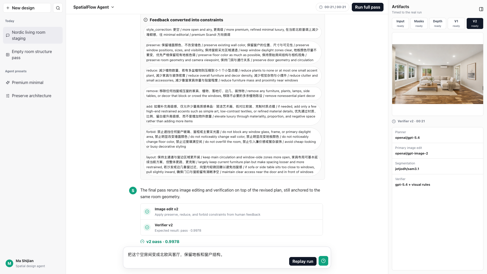

# SpatialFlow Agent

[](https://github.com/IIIIQIIII/spatialflow-agent/actions/workflows/ci.yml)

SpatialFlow Agent is a Codex-derived visual agent project for room editing workflows. This repository now contains the full project surface, not just the web demo:

- the core Python perception/planning/editing/verifier pipeline
- the Codex-oriented plugin and skill layer
- the chat-style web product UI
- bundled sample inputs and sample run artifacts
- a runnable end-to-end pipeline script that emits trace, bundle, and demo outputs

## Preview



## Project lineage

This project is a second-stage productization effort built on top of an open-source Codex agent pattern.

- The interaction model is Codex-style: long-horizon task execution with tool traces and artifact outputs.
- The domain is specialized away from coding into spatial design and room-editing workflows.
- The repository includes both the Codex-derived harness layer and the domain execution stack.

In short: this is not only a frontend replay. It is the full Codex-derived SpatialFlow agent project.

Architecture details:

- [docs/ARCHITECTURE.md](docs/ARCHITECTURE.md)
- [CONTRIBUTING.md](CONTRIBUTING.md)
- [SECURITY.md](SECURITY.md)
- [CODE_OF_CONDUCT.md](CODE_OF_CONDUCT.md)
- [CHANGELOG.md](CHANGELOG.md)

## What is in this repo

- `tools/`: core Python modules for perception, geometry, planning, editing, verification, and HITL review
- `configs/spatialflow-agent.json`: tool registry and agent contract
- `codex-plugin/`: Codex-facing plugin/skill packaging for the agent
- `scripts/run_full_pipeline.py`: end-to-end pipeline runner
- `src/`, `server/`: chat-style product UI and artifact server
- `demo-data/`: bundled sample run used by the web UI by default
- `inputs/`: sample room image plus open dataset provenance metadata

## Repository map

```text
spatialflow-agent/
  codex-plugin/            Codex-derived plugin and skill packaging
  configs/                 Agent contract and tool registry
  tools/                   Python execution pipeline
  scripts/                 End-to-end runner and demo tooling
  src/ + server/           Web product layer
  inputs/                  Open sample inputs
  demo-data/               Bundled deterministic sample run
  docs/                    Architecture and media
```

## Core pipeline

The full pipeline is:

1. `room_spatial_parser.py`
2. `depth_layout_estimator.py`
3. `layout_action_planner.py`
4. `visual_edit_executor.py`
5. `visual_verifier.py`
6. `hitl_review.py`

The runner script stitches these together and writes:

- `trace.json`
- `bundle.json`
- `demo.html`
- per-tool stdout/stderr logs

## From Codex To SpatialFlow

The main adaptation points are:

- replace code-centric tool use with room-editing tool use
- keep long-horizon task orchestration and explicit artifacts
- add spatial state, geometry, and verifier-driven constraints
- add human-in-the-loop review and revision as part of the default loop
- keep a product UI that makes the agent trace inspectable

## Quick start

### 1. Install JavaScript dependencies

```bash
npm install
```

### 2. Install Python dependencies

```bash
python3 -m venv .venv
source .venv/bin/activate
pip install -r requirements.txt
```

### 3. Live pipeline model/API setup

For the real editing pipeline, OpenRouter access is required for image editing and GPT-based review:

```bash
cp .env.openrouter.example .env.openrouter
```

For SAM 3.1 local masks, point the repo at your local SAM 3 codebase and checkpoint:

```bash
export SAM3_SOURCE_DIR=/path/to/sam3
export SAM31_CHECKPOINT=/path/to/sam3.1_multiplex.pt
```

If you want the SAM 3.1 mask path to run for real instead of falling back, install the local SAM 3 package into the same venv:

```bash
pip install -e "$SAM3_SOURCE_DIR" pycocotools
```

The Python requirements now include the extra runtime pieces needed by the default B200 path:

- `torchvision` for the Qwen3.5 visual routes
- `iopath` for the SAM 3.1 codebase import path
- `numpy<2` and `opencv-python<5` so the base environment stays compatible with the editable SAM 3 install

### 4. Install JavaScript runtime on a fresh Ubuntu GPU box

If `node` or `npm` is missing:

```bash
curl -fsSL https://deb.nodesource.com/setup_20.x | sudo -E bash -
sudo apt-get install -y nodejs
```

### 5. Run the full pipeline

```bash
python3 scripts/run_full_pipeline.py
```

Or through npm:

```bash
npm run pipeline
```

This creates a new run under:

```text
outputs/spatialflow-<timestamp>/
```

### 6. Run with human feedback

```bash
python3 scripts/run_full_pipeline.py --feedback "更空、更高级、减少植物、保留墙色和窗户，不要挡窗，地板颜色也尽量不要变"
```

### 7. Run the no-GPU smoke test

```bash
npm run smoke:check
```

This path does not call heavy models. It materializes a complete run from bundled sample artifacts and still writes:

- `trace.json`
- `bundle.json`
- `demo.html`

That makes the full project reproducible in CI and explorable on machines without a configured vision stack.

## Web UI

The web UI is part of the complete project, but it is no longer the only public artifact.

Run locally:

```bash
npm run dev
```

Then open:

- UI: `http://127.0.0.1:4009`
- API: `http://127.0.0.1:4188/api/state`

By default, the UI reads from `demo-data/default-run`, so a fresh clone already has a complete visual walkthrough.

## Codex integration

The Codex-derived integration layer lives in:

```text
codex-plugin/
```

It packages:

- the plugin manifest
- the SpatialFlow agent skill
- the Codex-facing domain instructions

That layer is included because this project was intended as Codex-based secondary development, not as a standalone frontend toy.

## Sample data and outputs

The repository includes:

- `inputs/room-dataset.png`
- `inputs/open_dataset/empty_room_source.metadata.json`
- `demo-data/default-run/`

This lets the repo work in two ways:

1. a runnable full project with live pipeline code
2. a deterministic sample experience for UI/demo/release purposes

## Recording a demo video

```bash
npm run record
```

The generated files are written to:

```text
outputs/spatialflow-chat-demo/
```

For a polished walkthrough clip, see the latest release assets.

## Validation

JavaScript build:

```bash
npm run build
```

Python syntax sanity check:

```bash
python3 -m py_compile scripts/run_full_pipeline.py tools/*.py
```

Full smoke test:

```bash
npm run smoke:check
```

Live B200-style verification:

```bash
npm install
npm run build
python3 scripts/run_full_pipeline.py --run-id spatialflow-live-check
```

Validated on an NVIDIA B200 SXM6 on July 8, 2026 from a fresh GitHub clone with the live path:

- `Qwen/Qwen3.5-9B` for room understanding
- `jetjodh/sam3.1` for masks and overlay output
- `openai/gpt-image-2` for editing
- `google/siglip2-so400m-patch14-384` plus `Qwen/Qwen3.5-9B` for verification
- `openai/gpt-5.4` for review question generation

GitHub Actions now runs:

- web build
- Python syntax check
- full smoke test materialization
- smoke output assertions

## Notes

- Some heavy models are optional and depend on your local GPU/runtime setup.
- `SAM 3.1` support is wired in, but you must provide the local codebase and checkpoint yourself.
- The live edit path expects a valid `OPENROUTER_API_KEY`; without it, the smoke path still works but the real edit/review steps will fail.
- The bundled sample run exists so the project remains explorable even without a configured GPU environment.

## License

GPL-3.0
