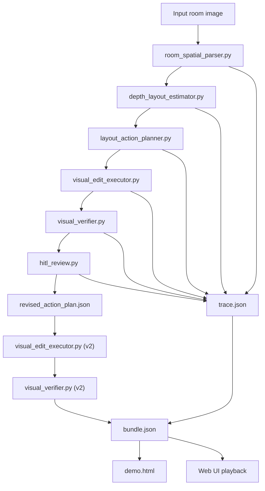

# Architecture

## Purpose

SpatialFlow Agent is a Codex-derived room-editing agent system. The repository combines:

- a Codex-style agent harness layer
- a domain-specific visual pipeline
- a chat-style product UI
- deterministic sample data for public demos

This matters because the project is not only a web replay. The central idea is to take a Codex-like long-horizon agent shell and specialize it into a spatial design product.

## System layers

### 1. Codex-derived harness layer

Location:

- `codex-plugin/`
- `configs/spatialflow-agent.json`

Responsibilities:

- define the agent identity and domain-specific behavior
- express the tool contract and expected outputs
- preserve the Codex-style task loop: observe -> plan -> execute -> verify -> revise

### 2. Core execution pipeline

Location:

- `tools/`
- `scripts/run_full_pipeline.py`

Responsibilities:

- parse room structure
- estimate layout and geometry
- generate an actionable edit plan
- execute visual editing
- verify the result
- add human-in-the-loop review and revision

### 3. Product UI layer

Location:

- `src/`
- `server/`

Responsibilities:

- present the run as a product conversation
- reveal artifacts over time
- make the agent loop legible to users and reviewers

### 4. Demo and reproducibility layer

Location:

- `demo-data/`
- `inputs/`
- `outputs/`

Responsibilities:

- bundle a deterministic sample run for public exploration
- preserve open input provenance
- provide stable release/demo assets

## Data flow



## Repository structure

```text
spatialflow-agent/
  codex-plugin/            Codex-derived plugin and skill packaging
  configs/                 Agent contract and tool registry
  tools/                   Python pipeline modules
  scripts/                 End-to-end runner and demo tooling
  src/                     React UI
  server/                  Express artifact server
  inputs/                  Open sample inputs and provenance
  demo-data/               Bundled deterministic sample run
  docs/                    Architecture and media
```

## Main runtime path

The standard full run entrypoint is:

```bash
python3 scripts/run_full_pipeline.py
```

This script orchestrates:

1. `room_spatial_parser.py`
2. `depth_layout_estimator.py`
3. `layout_action_planner.py`
4. `visual_edit_executor.py`
5. `visual_verifier.py`
6. `hitl_review.py`
7. optional v2 rerun when feedback is provided

## Output contract

Each full run creates a directory under:

```text
outputs/spatialflow-<timestamp>/
```

Expected artifacts:

- `base/`: first-pass pipeline outputs
- `review/`: review questions and interaction state
- `hitl-v2/`: revision artifacts when feedback is provided
- `trace.json`: step-by-step execution record
- `bundle.json`: summarized run package
- `demo.html`: portable visual summary

## What is actually “Codex-derived”

The Codex lineage is not marketing wording. It shows up in three concrete places:

1. The agent interaction model:
   long-horizon, tool-using, artifact-producing task execution rather than single-shot generation.

2. The plugin/skill packaging:
   the repo includes a Codex-facing domain layer instead of exposing only standalone scripts.

3. The productization goal:
   the project turns a generic agent shell into a specialized visual workflow product for room editing.

## What is domain-specific

The SpatialFlow specialization adds:

- room-state representation
- structure-preserving visual constraints
- geometry-aware edit planning
- verifier-driven image quality checks
- human-in-the-loop review and revision
- demo playback designed for visual product storytelling

## Public vs environment-dependent parts

Bundled and public:

- UI
- pipeline source code
- plugin/skill layer
- open sample input
- bundled sample run

Environment-dependent:

- OpenRouter API key
- GPU runtime
- local SAM 3 / SAM 3.1 code and checkpoint
- optional heavy vision/editing model installs

## Smoke-test mode

The repository also supports a no-model smoke path:

```bash
python3 scripts/run_full_pipeline.py --smoke-test
```

This mode:

- copies bundled sample artifacts from `demo-data/default-run/`
- writes a fresh `outputs/spatialflow-smoke-.../`
- generates `trace.json`, `bundle.json`, and `demo.html`
- avoids all heavy model execution

It exists so the full project can be validated in CI and inspected on ordinary machines without weakening the complete architecture.

## Design intent

The repo is meant to be legible in two modes:

1. as a public open-source project someone can inspect and run partially
2. as a serious product prototype showing how a Codex-derived agent can be specialized into a visual workflow system
